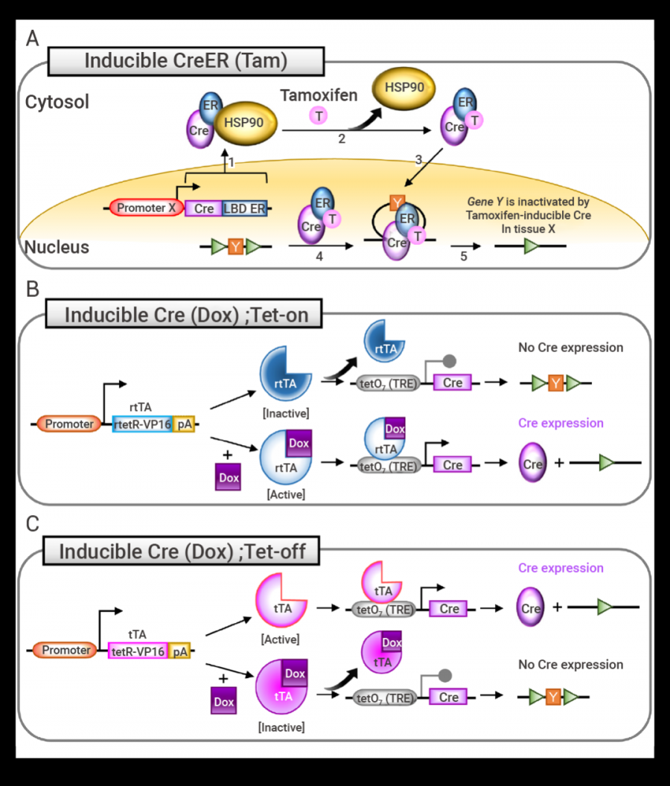
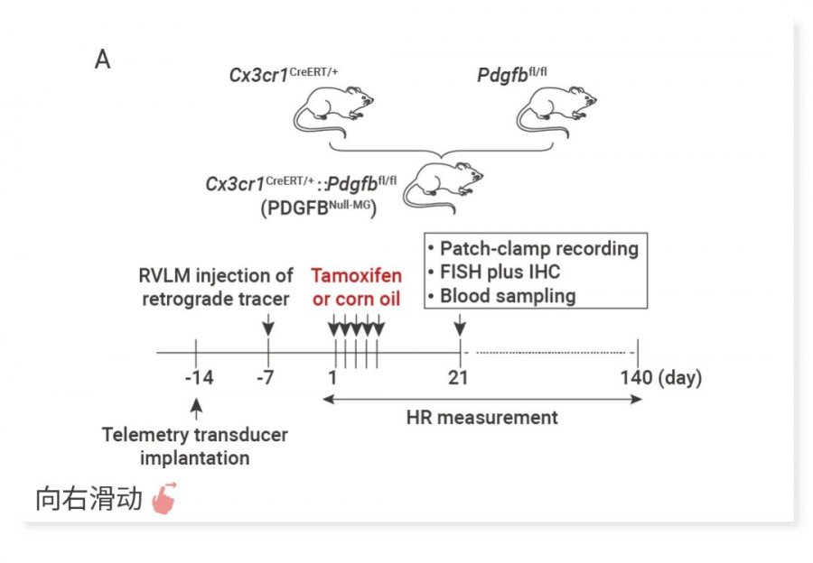
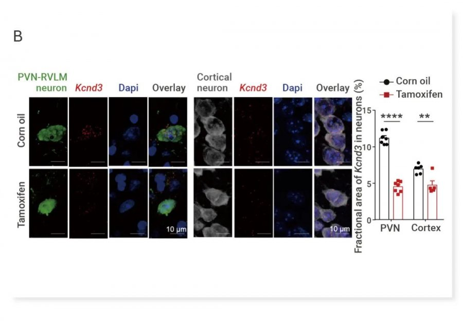

条件性基因敲除小鼠的设计利用了Cre/LoxP或Flipe/Frt原理。它们都是位点特异性重组酶系统。

<https://www.ouryao.com/forum.php?mod=viewthread&tid=769016>

## Cre/LoxP系统

Cre-LoxP 系统是一种基于位点特异性重组的基因编辑技术，由 <mark>Cre 重组酶</mark>和<mark>LoxP 位点</mark> 两部分组成。Cre/loxP系统来源于噬菌体，可以介导位点特异的DNA重组 。

1. Cre 重组酶 (Cyclization Recombination Enzyme) 由噬菌体 P1 的环化重组酶基因编码的一个由343个氨基酸组成的 38 kDa 的 DNA 重组酶，可以识别两个 loxP (locus of x-over, P1) 位点之间的的特定 DNA 片段序列，并介导两个 loxP 位点之间 DNA 序列的位点特异性缺失。如果将Cre重组酶cDNA通过基因工程的手段置于组织或细胞特异性启动子之下，可以得到Cre组织/细胞特异性表达的Cre小鼠，也叫Cre工具小鼠。

{fig-align="center" width="80%"}

2. loxP 位点是一个 34 bp的DNA序列，由两个 13 bp 的反转和回文重复序列和 8 bp 的核心序列组成。 LoxP的方向由中间这8个碱基决定。LoxP序列是Cre重组酶识别的位点。如果在待敲除的一段目标DNA序列的某个外显子的两端各放置一个loxP序列，得到flox(flanked by loxP)小鼠。这种Flox小鼠一般要通过设计构建打靶载体、胚胎干细胞重组 、囊胚显微注射、和嵌合体小鼠传代来获得。

将flox小鼠与带有组织/细胞特异性表达Cre工具小鼠交配繁殖，以获得在特定组织/细胞里把目标基因敲除掉的小鼠，即条件性基因敲除小鼠。由于Cre的表达，介导两个LoxP位点序列的重组，从而敲除两个LoxP之间的序列。由于不同Cre工具小鼠的Cre表达有组织/细胞特异性，就可以达到在不同组织、细胞里特异性敲除目的基因的目标。比如上皮细胞、胸腺细胞、T细胞、B细胞、心肌细胞、肠道、肺脏等。此外，若与控制Cre表达的其他诱导系统(比如CreERT2)相结合，还可以对某一基因同时实现时空两方面的调控。

## 常用的 Cre-loxP 诱变系统

{fig-align="center"}

Cre-ER (Tam) 系统，也称为他莫昔芬 (Tamoxifen) 诱导的 Cre 系统，是 Cre-LoxP 系统中最为常用的一种诱导型系统

该系统通过将 Cre 重组酶与与含有突变配体结合域的雌激素受体 (ER-LBD) 融合，形成 CreER 融合蛋白。在没有 Tamoxifen 的情况下，CreER 融合蛋白与热休克蛋白 90 (HSP90) 相互作用并定位于细胞质中。给予他莫昔芬/ 4-羟基他莫昔芬后，会破坏 HSP90 与 CreER 的相互作用，使 CreER 进入细胞核，识别并切割 LoxP 位点间的 DNA 序列，从而实现条件性基因敲除\[1\]。

为了提高他莫昔芬或 4-OHT 诱导的效率，在 CreERT 后产生 CreERT2，它在体内对 4-OHT 的敏感性约为 CreERT 的 10 倍。因此，CreERT2 在一些生物学领域更受青睐

{fig-align="center"}

{fig-align="center"}

## Flox小鼠设计

那如何设计条件性基因敲除小鼠呢?

这里所说的设计主要是Flox小鼠的设计。所谓条件性敲除，是说除了特定细胞外，其它细胞里面没有任何的基因表达异常。一般情况下，不要在第一个外显子前面放置LoxP序列。因为第一个外显子前面一般是启动子。放置LoxP序列有可能会破坏或改变启动子活性。

条件性敲除一般是敲掉最早引起移码突变的外显子。这样的话，最好不要敲除有起始密码子ATG的外显子。否则的话，基因可能会利用ORF内的ATG编码一个缺少部分N端序列的蛋白，这个蛋白很可能有全部或部分野生蛋白的功能。

在选择要敲除的外显子的时候(各放一个LoxP在一个外显子的两侧)，该外显子的碱基数目不能是3N，否则新基因pre-RNA拼接得到的mRNA不能产生移码突变。会产生一个与野生蛋白相比少了一段中间序列的新蛋白。

如果一个外显子的碱基数目是3N+1或3N+2，敲除这个外显子之后会产生移码突变，就可以达到基因敲除的目的。筛选要敲除(Floxed)的外显子的时候，一般是从最上游的外显子开始筛选适合敲除的外显子。

需要注意的是，一般的DNA分析软件 不能确定内含子和外显子的边界，需要仔细核对。95%以上的边界遵循gt/ag边界原则。也可以在Ensembl上查一个基因的外显子和内含子。这个网站上的结果绝大部分是正确的。但也需要仔细核对。

毕竟基因敲除小鼠研发是一个时间比较长的过程，需要特别小心。前期做多少的考虑都不嫌多。这些原则只是对一般课题的考虑。特殊情况需要特殊处理。比如，如果只是想敲除一个基因的某个特定domain，或是如果一个基因有一个很大的外显子，这个时候即使这个外显子的碱基数目是3N，也可以对其进行敲除。

**1. 构建 Flox 小鼠：**首先，将 LoxP 序列插入到需要删除 DNA 区域的两端，这一区域通常被称为 flox 区。获得的小鼠称为 Flox 小鼠，其基因功能在正常情况下保持不变。\
\
**2. 选择 Cre 工具鼠：**根据实验需求，选择具有组织或细胞特异性启动子的 Cre 工具鼠。这些小鼠能够在特定的组织或细胞中表达 Cre 重组酶。\
**3. 杂交与筛选：**将 Flox 小鼠与 Cre 工具鼠进行杂交，通过多代交配筛选出同时携带 Flox 基因和 Cre 基因的小鼠。这些小鼠在特定组织或细胞中，当 Cre 重组酶表达时，会实现条件性基因敲除\[1\]。

**诱导方法**\

|                                                                                                                                                                       |                                                                                                                                   |
| --------------------------------------------------------------------------------------------------------------------------------------------------------------------- | --------------------------------------------------------------------------------------------------------------------------------- |
| **药物**                                                                                                                                                                | **方法**                                                                                                                            |
| Tamoxifen                                                                                                                                                             | Adult PdgfbNull-MG mice; 75 mg/kg Tamoxifen (dissolved in corn oil) intraperitoneal injection (i.p.) for 5 consecutive days\[3\]. |
| Hif1af/f; Foxl2-CreERT2 female mice (3 weeks); 100 mg/kg Tamoxifen (freshly dissolved in sunflower oil) intraperitoneal injection (i.p.) for 5 consecutive days\[5\]. |                                                                                                                                   |
| Doxycycline                                                                                                                                                           | C57BL/6 tetO-Cre mice (TRE-Cre); 600 mg/kg Doxycycline-containing diet for 14 days\[6\].                                          |

参考详情：\
\[1\] Kim H, et al. Mouse Cre-LoxP system: general principles to determine tissue-specific roles of target genes. Lab Anim Res. 2018 Dec;34(4):147-159.\
\
\[2\] Indra AK, et al. Temporally-controlled site-specific mutagenesis in the basal layer of the epidermis: comparison of the recombinase activity of the tamoxifen-inducible Cre-ER(T) and Cre-ER(T2) recombinases. Nucleic Acids Res. 1999;27(22):4324-4327.\
\[3\] Bi Q, et al. Microglia-derived PDGFB promotes neuronal potassium currents to suppress basal sympathetic tonicity and limit hypertension. Immunity. 2022 Aug 9;55(8):1466-1482.e9.\
\[4\] Perl AK, et al. Early restriction of peripheral and proximal cell lineages during formation of the lung. Proc Natl Acad Sci U S A. 2002;99(16):10482-10487.\
\[5\] H, Wang J. FSHR-mTOR-HIF1 signaling alleviates mouse follicles from AMPK-induced atresia. Cell Rep. 2023 Oct 31;42(10):113158.\
\[6\] Lewis KT, et al. Tetracycline response element driven Cre causes ectopic recombinase activity independent of transactivator element. Mol Metab. 2022 Jul;61:101501.\
\[7\] Donocoff RS, et al. Optimization of tamoxifen-induced Cre activity and its effect on immune cell populations. Sci Rep. 2020;10(1):15244.\
\[8\] Feil S, Valtcheva N, Feil R. Inducible Cre mice. Methods Mol Biol. 2009;530:343-63.\
\[9\] Jahn HM, et al. Refined protocols of tamoxifen injection for inducible DNA recombination in mouse astroglia. Sci Rep. 2018 Apr 12;8(1):5913.
