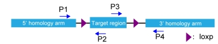

条件性基因敲除小鼠的设计利用了Cre/LoxP、Flipe/Frt、Dre-Rox等染色体（DNA）位点特异性重组酶系统，其中常用的是Cre-LoxP系统。

条件性基因敲除小鼠（也叫Flox小鼠）是指在目的基因中含有成对的LoxP位点的小鼠，与Cre工具小鼠交配后可在特定的组织或细胞中敲除目的基因。

## Cre/LoxP系统

Cre-LoxP 系统是一种基于位点特异性重组的基因编辑技术，由 <mark>Cre 重组酶</mark>和<mark>LoxP 位点</mark> 两部分组成。Cre/loxP系统来源于噬菌体，可以介导位点特异的DNA重组 。

1.  loxP 位点是一个 34 bp的DNA序列，由两个 13 bp 的反向重复序列和 8 bp 的核心序列组成。 LoxP的方向由中间这8个碱基决定。（当 DNA 分子上存在两个同向 loxP 序列时，Cre可将两个loxP 序列之间的DNA 片段切出并环化，同时将 loxP 两侧的序列进行连接；当 DNA 分子上存在两个方向相反的 loxP 序列时，Cre 可导致 loxP 之间的序列发生反转。）

    LoxP序列是Cre重组酶识别的位点。如果在待敲除的一段目标DNA序列的某个外显子的两端各放置一个loxP序列，得到flox(flanked by loxP)小鼠。这种Flox小鼠一般要通过设计构建打靶载体、胚胎干细胞重组 、囊胚显微注射、和嵌合体小鼠传代来获得。

2.  Cre 重组酶 (Cyclization Recombination Enzyme) 由噬菌体 P1 的环化重组酶基因编码的一个由343个氨基酸组成的 38 kDa 的 DNA 重组酶，可以识别两个 loxP (locus of x-over, P1) 位点之间的的特定 DNA 片段序列，并介导两个 loxP 位点之间 DNA 序列的位点特异性缺失。如果将Cre重组酶cDNA通过基因工程的手段置于组织或细胞特异性启动子之下，可以得到Cre组织/细胞特异性表达的Cre小鼠，也叫Cre工具小鼠。

条件性基因敲除的靶基因中必须带有可以被 Cre 重组酶识别的 loxP 序列，这种基因称为 floxed gene。带有 floxed 靶基因的小鼠称为 flox 小鼠。在这种小鼠中，通常采用 DNA 同源重组方法，在拟敲除基因片段的两侧分别放置一个**同向的 loxP 位点**。loxP 位点的存在应不影响该基因的功能，故选择对照为flox/flox小鼠

{fig-align="center" width="50%"}

实验时，将 flox 小鼠和 Cre 工具鼠进行交配，最后获得 flox 纯合且 Cre 杂合的小鼠。在这类小鼠中，凡是表达 Cre 的细胞，两个 loxP 之间的序列被切除，从而实现组织特异性基因敲除。

将flox小鼠与带有组织/细胞特异性表达Cre工具小鼠交配繁殖，以获得在特定组织/细胞里把目标基因敲除掉的小鼠，即条件性基因敲除小鼠。由于Cre的表达，介导两个LoxP位点序列的重组，从而敲除两个LoxP之间的序列。由于不同Cre工具小鼠的Cre表达有组织/细胞特异性，就可以达到在不同组织、细胞里特异性敲除目的基因的目标。比如上皮细胞、胸腺细胞、T细胞、B细胞、心肌细胞、肠道、肺脏等。此外，若与控制Cre表达的其他诱导系统(比如CreERT2)相结合，还可以对某一基因同时实现时空两方面的调控。

## Flox小鼠设计

一般情况下，不要在第一个外显子前面放置LoxP序列。因为第一个外显子前面一般是启动子。放置LoxP序列有可能会破坏或改变启动子活性。

条件性敲除一般是敲掉最早引起移码突变的外显子。这样的话，最好不要敲除有起始密码子ATG的外显子。否则的话，基因可能会利用ORF内的ATG编码一个缺少部分N端序列的蛋白，这个蛋白很可能有全部或部分野生蛋白的功能。

在选择要敲除的外显子的时候(各放一个LoxP在一个外显子的两侧)，该外显子的碱基数目不能是3N，否则新基因pre-RNA拼接得到的mRNA不能产生移码突变。会产生一个与野生蛋白相比少了一段中间序列的新蛋白。

如果一个外显子的碱基数目是3N+1或3N+2，敲除这个外显子之后会产生移码突变，就可以达到基因敲除的目的。筛选要敲除(Floxed)的外显子的时候，一般是从最上游的外显子开始筛选适合敲除的外显子。

需要注意的是，一般的DNA分析软件 不能确定内含子和外显子的边界，需要仔细核对。95%以上的边界遵循gt/ag边界原则。也可以在Ensembl上查一个基因的外显子和内含子。这个网站上的结果绝大部分是正确的。但也需要仔细核对。

毕竟基因敲除小鼠研发是一个时间比较长的过程，需要特别小心。前期做多少的考虑都不嫌多。这些原则只是对一般课题的考虑。特殊情况需要特殊处理。比如，如果只是想敲除一个基因的某个特定domain，或是如果一个基因有一个很大的外显子，这个时候即使这个外显子的碱基数目是3N，也可以对其进行敲除。

**1. 构建 Flox 小鼠：**首先，将 LoxP 序列插入到需要删除 DNA 区域的两端，这一区域通常被称为 flox 区。获得的小鼠称为 Flox 小鼠，其基因功能在正常情况下保持不变。\
\
**2. 选择 Cre 工具鼠：**根据实验需求，选择具有组织或细胞特异性启动子的 Cre 工具鼠。这些小鼠能够在特定的组织或细胞中表达 Cre 重组酶。\
**3. 杂交与筛选：**将 Flox 小鼠与 Cre 工具鼠进行杂交，通过多代交配筛选出同时携带 Flox 基因和 Cre 基因的小鼠。这些小鼠在特定组织或细胞中，当 Cre 重组酶表达时，会实现条件性基因敲除。

### 交配策略

<mark>实验组：flox阳性纯合且Cre阳性小鼠（geneflox/flox；Cre+），对照组：flox阳性纯合（geneflox/flox）</mark>

## Flox小鼠基因型鉴定（用于鉴定flox纯合、杂合和野生型）

PCR鉴定引物位置示意图（可选择P1,P2引物对，或P3,P4，P1,P4引物对）

## 目的基因组织特异性敲除效果验证

（1） DNA水平cre活性验证

通常是取一小块表达Cre的组织，抽提基因组DNA，通过PCR的方法对flox区域进行扩增，通过flox区域的有无，定性判断Cre是否发挥作用。

（2） RNA水平cre敲除效率验证

通常是取一小块表达Cre的组织，抽提RNA，反转录成cDNA后，通过Real-time PCR的方法，利用Cre作用后的mRNA ，所设计的引物无法扩增出PCR产物的原理，定量判断Cre作用效率。

（3） 蛋白水平cre敲除效率验证

目的组织western blot或免疫组化检测。原理：表达cre的组织无法检测到目的蛋白。

### 动物组织DNA抽提

1) 250ul 裂解液+2.5ul proteinase K(10mg/ml) 直接消化组织，放于55℃恒温热浴过夜

2) 加入同体积（250ul）苯酚：氯仿：异戊醇混合物（使用前摇晃瓶身混匀），上下剧烈震荡15s，12000rpm,15min常温离心

3) 转移上清于新的EP管（期间可能会吸起白色絮状物，无妨）

4) 加入等体积的异丙醇，上下剧烈震荡15s,12000rpm,15min常温离心

5) 倒掉上清（也可用真空泵吸，小心底部沉淀），用75%乙醇（400ul），7500rpm, 5min（可多清洗2遍）

6) 将管壁内部及管盖上的残留乙醇吸干，沉淀相对较干，根据不同体积加入ddH2O

注：因没加RNA酶，可能会残余RNA，A260/280会居于1.9以上，但PCR无妨

lysis buffer配制（裂解液）：先加水500ml，再加各种成分，最后定容到1L

|                  |            |
|------------------|------------|
| 成分             | 配置（1L） |
| 1M Tris 8.0-100x | 10mL       |
| 5M Tris 8.0-50x  | 20mL       |
| 0.5M EDTA-20x    | 50mL       |
| 10% SDS          | 50mL       |

## 推荐阅读

1.  <https://www.ouryao.com/forum.php?mod=viewthread&tid=769016>

2.  <http://lsi.zju.edu.cn/2020/0209/c45388a1959204/page.htm>
