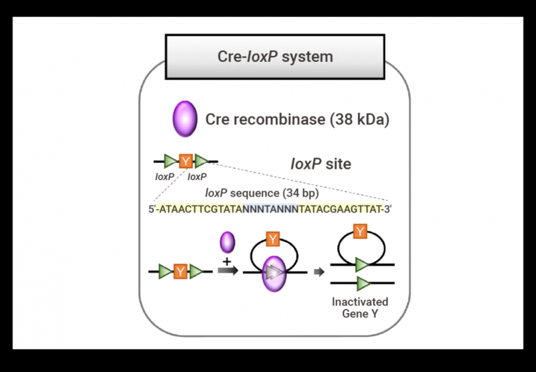

位点特异性重组酶系统：Cre/LoxP、Flipe/Frt、Dre-Rox

## Cre/LoxP系统

Cre-LoxP 系统是一种基于位点特异性重组的基因编辑技术，由 <mark>Cre 重组酶</mark>和<mark>LoxP 位点</mark> 两部分组成。Cre/loxP系统来源于噬菌体，可以介导位点特异的DNA重组 。

1.  loxP 位点是一个 34 bp的DNA序列，由两个 13 bp 的反向重复序列和 8 bp 的核心序列组成。 LoxP的方向由中间这8个碱基决定。（当 DNA 分子上存在两个同向 loxP 序列时，Cre可将两个loxP 序列之间的DNA 片段切出并环化，同时将 loxP 两侧的序列进行连接；当 DNA 分子上存在两个方向相反的 loxP 序列时，Cre 可导致 loxP 之间的序列发生反转。）

2.  Cre 重组酶 (Cyclization Recombination Enzyme) 由噬菌体 P1 的环化重组酶基因编码的一个由343个氨基酸组成的 38 kDa 的 DNA 重组酶，可以识别两个 loxP (locus of x-over, P1) 位点之间的的特定 DNA 片段序列，并介导两个 loxP 位点之间 DNA 序列的位点特异性缺失。如果将Cre重组酶cDNA通过基因工程的手段置于组织或细胞特异性启动子之下，可以得到Cre组织/细胞特异性表达的Cre小鼠，也叫Cre工具小鼠。

{fig-align="center" width="50%"}

## 推荐阅读

1.  <https://www.ouryao.com/forum.php?mod=viewthread&tid=769016>

2.  <http://lsi.zju.edu.cn/2020/0209/c45388a1959204/page.htm>
