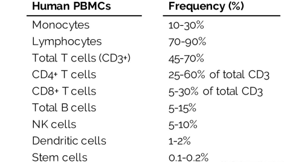
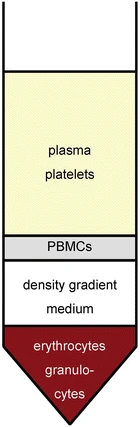

[Peripheral Blood Mononuclear Cells: Isolation, Freezing, Thawing, and Culture](https://doi.org/10.1007/7651_2014_99)

**外周血单个核细胞**（Peripheral Blood Mononuclear Cells，PBMCs）包括T、B淋巴细胞（Lymphocyte）、NK细胞、单核细胞（Monocyte）、树突状细胞（DC）和其他少量细胞

## 试剂和仪器

### 试剂

1.  1× Phosphate Buffered Saline (PBS) Sterile PBS 无菌PBS
2.  Ficoll Histopaque
3.  二甲亚砜（DMSO）
4.  血清白蛋白（BSA）
5.  10%胎牛血清（FBS）
6.  Freshly collected heparinised blood 新鲜采集的肝素化血液
7.  Ficoll Histopaque (Sigma-Aldrich, catalog number: 10771; MP Biomedicals, catalog number: 091692254)： <mark>Ficoll</mark>是蔗糖的多聚体，中性，平均分子量400,000，当密度为1.2g/mL，未超出正常生理性渗透压，也不穿过生物膜。红细胞、粒细胞比重大，离心后沉于管底；淋巴细胞和单核细胞的比重小于或等于分层液比重，离心后漂浮于分层液的液面上，也可有少部分细胞悬浮在分层液中。吸取分层液液面的细胞，就可从外周血中分离到单个核细胞。
8.  细胞冻存液：FBS中加入10%DMSO

### 仪器

-   Heparin vials (BD Biosciences, catalog number: 367886) 肝素小瓶
-   Centrifuge - Sterile 15 ml centrifuge tube 无菌15ml离心管
-   Pipette gun移液枪和1ml枪头

## 实验操作

1.  收集4 ml人静脉血于肝素化小瓶中，轻轻翻转试管数次，使其充分混合

2.  <mark>**PBS什么时候加**</mark>等体积稀释血液

3.  移取4毫升Ficoll Histopaque到15ml离心管中

4.  使用1毫升移液枪将血液缓慢地沿管壁注入Ficoll Histopaque的顶部。血液和Ficoll Histopaque应该保持为两个不同的层。

5.  Fixed angle rotors Centrifuge **时间**min，**转速**×g，4℃，<mark>**？升降**</mark>

6.  立即（5min内）抽吸在组织水和培养基之间的界面中形成的白色棕褐色涂层（约1毫升）（PBMC）

    {width="21%"}

7.  用10 ml无菌PBS**洗涤**（在1 x g中离心**时间**分钟）两次。来自4ml血液的细胞的近似产率在$10^7$\~$10^8$之间变化。

8.  细胞计数或培养：加入5-10ml培养基重悬细胞，进行后续计数培养或者铺板；

9.  **细胞冻存**：将细胞离心收集之后，用细胞冻存液重悬。取1-1.5ml细胞至冻存管中，放入冻存盒（冻存盒可事先在4℃冰箱预冷）。再将冻存盒放置于-80℃冰箱过夜。第二天将细胞转入液氮（-196℃）中长期保存。

> 1.  Ficoll Histopaque和人类血液样本、***PBS*** **?**之间的比例为\***1:1:1**。对于其它物种的PBMC的纯化比例可以是不同的。
> 2.  Ficoll Histopaque储存在4°C温度下。使用前需要在室温下保持1-2小时，因为如果PBMC在预冷的Ficoll Histopaqueon血样中分层，PBMC会受到冷休克，有时会聚集
