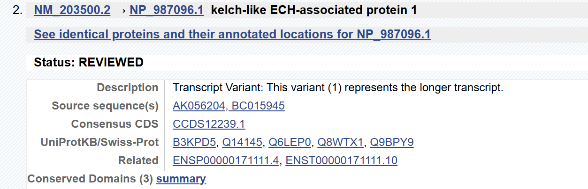
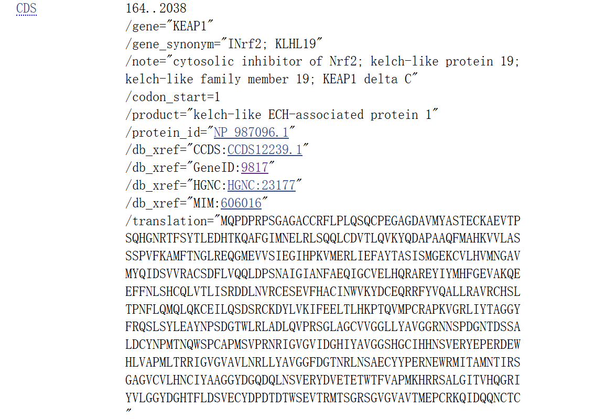
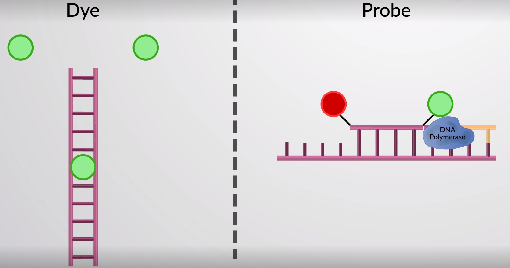
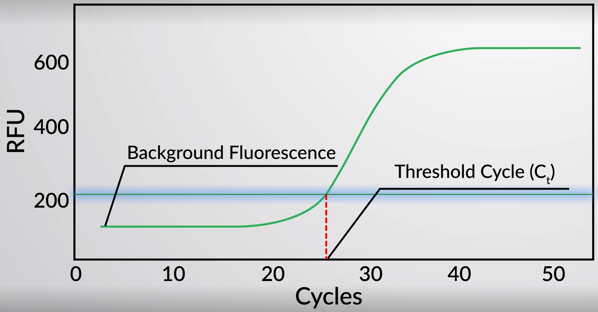

聚合酶链式反应（逆转录+ ）荧光定量实时PCR

[PCR 和 RT-PCR](http://lsi.zju.edu.cn/2020/0214/c45388a1959653/page.htm)

**条件：**Primers、DNA、DNA Polymerase、Buffer、dNTP、dH~2~O  (具体比例参见实验Protocol)

**参数：**PCR循环数：通常为25-35次。不建议使用超过45个循环，循环数过多将导致非特异性条带产生。

Tm值：Tm=( 2℃ × number of A , T ) + ( 3℃ × number of G , C )

延伸时间：以实验室常用酶Taq酶为例，产物长度每1kb需要1min，可适当延长3-5 s。

## 引物设计

-   引物单链长度建议在17-24bp为佳

-   RT-PCR引物设计引物长度建议控制在100-250bp之间，且两条引物的Tm值尽量接近一致；

-   严格的引物特异性检验。不仅在网上Blast比对分析，还需PCR跑胶确定条带为特异单一

-   NCBI的Primer-Blast <http://www.ncbi.nlm.nih.gov/tools/primer-blast/>

-   Primer3 Plus （<http://www.primer3plus.com/>）

-   PrimerBank <https://pga.mgh.harvard.edu/primerbank/>

***KEAP1*****/*STK11***

内参引物18s rRNA /β-Actin

|             |                      |
|-------------|----------------------|
| 18S(qPCR)-F | GACTCAACACGGGAAACCTC |
| 18S(qPCR)-R | AGCATGCCAGAGTCTCGTTC |

## 试剂、耗材和仪器

罗氏温度梯度荧光定量PCR仪：预约，电源开机，初始化，Ready，

1.  热稳定DNA聚合酶（*taq*酶，-20℃）。
2.  10×PCR扩增缓冲液。
3.  25 mmol/L $MgCl_2$。
4.  4种脱氧单核苷三磷酸（dNTPs）混合贮存液（20 mmol/L,pH=8.0,-20℃）
5.  50×TAE缓冲液
6.  阴性对照模板DNA
7.  正向引物(F,20μmol/L)及反向引物(R,20μmol/L)溶于灭菌$ddH_2O$中
8.  EB（溴化乙锭）或荧光染料（Gel-Red）

{width="80%"}

1.  **SYBR green I染料**：在与dsDNA双螺旋小沟结合时，会在每个PCR循环结束时，绿色激发波长的光下激发染料发出荧光，**非特异，**
2.  Taqman引物探针类：使用与荧光团（报告基团，reporter，R）和猝灭剂分子（quencher，Q）相连的互补序列**特异性**寡核苷酸探针，持续暴露于适当波长的光下，并且猝灭剂分子在彼此靠近时吸收荧光团的荧光。DNA聚合酶在延伸过程中分离荧光团，防止淬灭

## 实验步骤与操作

1.  目的细胞的培养

2.  （RNA的提取：Trizol法、硅吸附法，磁珠法）

3.  cDNA的制备

    1.  反转录体系
    2.  引物设计
    3.  半定量PCR反应体系
    4.  **RF PCR反应体系**：SYBR Premix Ex TaqTM
    5.  核糖核酸酶RNase H降解原始mRNA，留下附着在cDNA上的primer
    6.  在DNA polymerase下合成互补链

4.  PCR 靶向扩增

    1.  引物设计（SYBR GREEN染料法）：20-24bp，纯度HPLC级别，无引物二聚体，退火60℃

    2.  引物配置

        1.  分子量计算公式：$$分子量 =C\times288+A\times312+G\times328+T\times303-61 $$或者==$$近似分子量\approx 碱基数\times 324.5$$==
        2.  引物工作浓度5-10 μmol/L,10 ×，20bp，2.0$OD_{260}$ $$1.0 OD_{260}=33\mu g Oligo DNA$$ 终浓度为50μmol/L
        3.  计算：$$分子量=20\times 324.5=6490 g/mol$$ $$质量数=2\times33=66\mu g$$ $$物质的量=66{\div}6490=0.010μmol$$ $$终体积=0.010{\div}50×10^6=200μL$$
        4.  离心机，$ddH_2O$溶解Oligo

    3.  PCR反应组分：20μl，模板DNA，正向引物，反向引物，PCR缓冲液（含$MgCl_2$)，*Taq*酶，dNTPs混合液

    4.  实验设计

        1.  校准品（calibrator）：未经处理的细胞，正常组等
        2.  空白对照（No Template Control，NTC）：用水代替cDNA模板——排除自身污染
        3.  RNA对照：排除自身残留基因组DNA污染
        4.  阳性对照（positive control，PC）：靶DNA片段，防止PCR反应抑制剂引起假阳性结果
        5.  阴性对照：P154 正向/反向引物，有/无模板DNA，非特异性配对，污染
        6.  生物学重复：不同的材料（时间、细胞株、批次、反应板）做的同一验证实验，至少3个
        7.  技术重复：同一材料的复孔，至少3个

    5.  PCR仪 两步法/三步法

        +----------------------+--------+--------+--------+----------------+
        | 步骤                 | 温度℃  | 时间   | 循环数 | 内容           |
        +======================+========+========+========+================+
        | 1.  变性Denaturation | 94-95  | 5min   | 1      | 预变性         |
        +----------------------+--------+--------+--------+----------------+
        | 1.  变性Denaturation | 94-95  | 10s    | 30-45  | 循环中模板变性 |
        +----------------------+--------+--------+--------+----------------+
        | 2.  退火Annealing    | 55\~65 | 20s    | 30-45  | 退火           |
        +----------------------+--------+--------+--------+----------------+
        | 3.  延伸Synthesis    | 72℃    | 20-30s | 30-45  | 延伸           |
        +----------------------+--------+--------+--------+----------------+
        |                      |        |        |        |                |
        +----------------------+--------+--------+--------+----------------+
        | 1.  变性Denaturation | 94-95  | 5min   | 1      | 预变性         |
        +----------------------+--------+--------+--------+----------------+
        | 1.  变性Denaturation | 94-95  | 10s    | 30-45  | 循环中模板变性 |
        +----------------------+--------+--------+--------+----------------+
        | 2.  退火/延伸        | 60-65  | 20s    | 30-45  | 2.  退火/延伸  |
        +----------------------+--------+--------+--------+----------------+

    6.  产物鉴定

        1.  DNA凝胶电泳
        2.  EB染色

分子表现出的荧光被光电探测器检测，将荧光信号转换为可读格式。<mark>**RFU**</mark>

实时荧光定量RT-PCR需要配备检测器的专用PCR仪来实现实时定量$$Threshold\ Cycle(C_t)$$是每个反应管内荧光信号达到设定阈值时所经历的PCR循环数，远高于背景荧光  初始样品中目标RNA的量越大，荧光显著增加的速度就越快，从而导致较低的Ct.即$$C_t=\frac{1}{Target RNA}$$ $$
 Ct=a×log \  mRNA + b
 $$

## 定量

### 简单相对定量——2^-Δ ΔCt^

假设扩增效率ET=ER=2

normalized relative ratio = 2^-Δ ΔCt^

ΔCt= Ct（target）- Ct（reference）描述了靶基因与内参基因Ct值的差值。

Δ ΔCt= ΔCt（sample）-ΔCt（calibratior）描述了感兴趣样品的平均ΔCt值与参考样品/校准样品的平均ΔCt值之间的差值。

适用于精确度要求不高的实验。

|     | Target Gene | reference gene | Normalized | Calibrated | Fold Difference |
|-----|-------------|----------------|------------|------------|-----------------|
|     | Ave Ct      | Ave Ct         | ΔCt        | Δ ΔCt      | 2^-Δ ΔCt^       |
| 0 H | 24.5        | 12.6           | 11.9       | 0          | 1               |
| 1 H | 23.2        | 12.5           | 10.7       | -1.2       | 2.3             |
| 2 H | 25.4        | 11.6           | 13.8       | +1.9       | 0.27            |

### 绝对定量——使用标准品进行绝对定量

$$
C_p=-k\lg X_0 + b
$$

-   横坐标：起始浓度的对数值，纵坐标：Cp值，

-   Efficiency=2（建议1.9-2.1），

-   R^2^ =1（建议\>0.99），

-   Error=0（建议\<0.2），

-   Slope=-3.3（建议-3.1\~-3.6）

### 如何判断Ct值的有效性

-   （染料法适用）熔解曲线在80-90℃之间出现唯一主峰，说明结果完美；如果80℃以下出现杂峰，说明引物二聚体，尝试提高退火温度，如果90℃以上出现杂峰，说明DNA污染。

-   空白对照排除自身污染

-   RNA对照：排除自身残留基因组DNA污染

-   引物扩增效率90\~110%，1.9-2.1

-   [The MIQE guidelines: minimum information for publication of quantitative real-time PCR experiments](https://doi.org/10.1373/clinchem.2008.112797)
