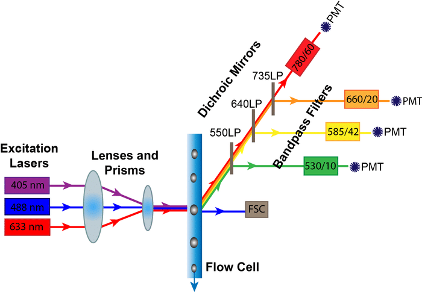

流式细胞术

<http://lsi.zju.edu.cn/2020/0213/c45388a1959560/page.htm>

## 参数

-   前向散射（Forward Scattering，FSC）：细胞大小，100nm-100μm

-   侧向散射（Side Scattering，SSC）：细胞复杂度

-   荧光：细胞特性

FSC-SSC散点图去除细胞碎片

去除粘连细胞doublet：FSC（A/H/W）任两组合，SSC（A，H，W）任两组合

荧光：自发荧光（NADPH、核黄素），荧光标签

上样速度越高，样本中心液流越粗，激光聚焦越差。CV增高，分辨率越低。

-   定性测量：流速要求不高，免疫分型

-   定量测量：低速，细胞周期检测

## 流式细胞仪结构

[{width="50%"}](https://bitesizebio.com/31638/flow-cytometry-optics-system/)

-   **激光器Lasers：**五种最常见的激光器是紫外 （355 nm）、紫光 （405 nm）、蓝光 （488 nm）、黄绿 （561 nm） 和红光 （633） 激光。

-   **二向色镜Dichroic Mirrors：**<mark>长通（long pass）滤光片</mark>允许等于或长于其指示波长的光通过，而<mark>短通（short pass）滤光片</mark>允许等于或短于其指示波长的光通过。因此，如果您的荧光团位于 600 LP 二向色镜上，这意味着只有长于 600 nm 的波长才会传输到下一个滤光片和检测器，而较短的波长将被偏转。

-   **带通滤光片Bandpass Filters：**带通滤光片只允许小范围的波长通过最终检测器。它们通常标有两个数字<mark>波长/带宽</mark>（例如，450/50表示425 到 475 纳米波长的光可以被检测到）

-   光电倍增管 （PMT）：将穿过镜子和滤光片的光子转换为产生电压脉冲的电子来放大信号。然后通过模数转化器将此电压脉冲转换为显示在计算机屏幕上的数字读数。电压脉冲的三个参数

    -   高度H：最大光信号强度

    -   宽度W：细胞与激光相互作用的时间

    -   面积细胞总体光信号强度

    -   去除粘连细胞

## 荧光素

注意<mark>激光激发波长，染料发射波长，长通-短通-带通</mark>

-   激发excitation光谱，最大激发波长λex

-   发射emission光谱，最大发射波长λem

-   斯托克斯位移Stocks Shift=λem - λex

分类：有机小分子，荧光蛋白，复合染料，大分子染料

荧光染料的亮度与目的蛋白的量成负相关

## 荧光补偿Compensation

荧光染料的发射光谱有一定范围，可以被不止一个通道检测到，在被溢出通道产生假阳性信号

荧光染料可以被不止一个激光激发

补偿前有拖尾，补偿后横平竖直——自动补偿：软件自动计算

补偿数值受电压的影响，但补偿数值并不会改变分辨率

荧光补偿的后遗症：**spreading error**，荧光溢出造成，降低了双阳性细胞在被溢出通道的分辨率，只能通过配色方案来降低影响。

<mark>**单色管对照**</mark>

-   荧光素匹配：一定要使用相同的荧光素

-   阴性群的自发荧光要与阳性群一致

-   必须有明显的阳性细胞群，阳性群的荧光强度应不低于样本

-   补偿样本必须和样本经过相同的处理

<mark>**荧光减一对照**</mark>

Fluorescence minus one (FMO) 针对圈门（阴阳群边界）的对照

如果您使用 4 种不同的荧光染料，您的 FMO 对照必须仅包含其中的 3 种（例如：荧光染料 – A、B、C、D;FMO – ABC\_、AB_D、A_CD 、\_BCD）

**空白对照**

阴性对照、阳性对照

同型对照

## 门控Gating

-   去除碎片：FSC-SSC散点图

-   去除粘连：FSC（A/H/W）任两组合，SSC（A，H，W）任两组合，共6个组合

-   活细胞

-   目的细胞

百分比，荧光强度（中位数）

## 计算分析Computational analysis

flowClust in [Bioconductor](https://en.wikipedia.org/wiki/Bioconductor)

 FlowCAP（流式细胞术：群体识别方法的关键评估）
