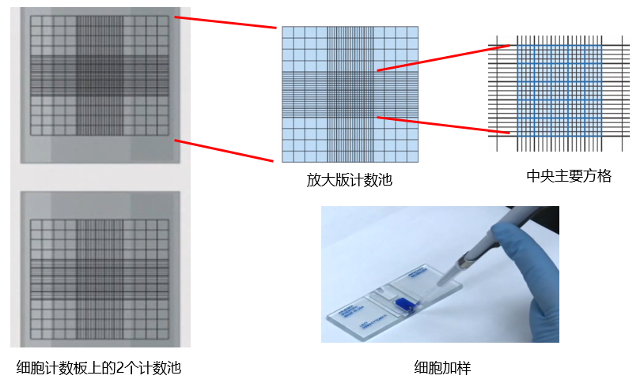

## **常见的肿瘤模型**

1. 诱发性肿瘤模型：

2. 移植性肿瘤模型：异位移植即皮下成瘤，原位移植（原位注射肺癌细胞）

3. 基因敲除鼠（如**非小细胞肺癌模型：**Kras-LSL-G12D小鼠模型，**小细胞肺癌模型：**Rbflox小鼠，p53 flox小鼠）

## 仪器、试剂与耗材

基质胶、细胞计数板、剃毛机、脱毛膏、1ml一次性无菌胰岛素注射器、1ml无菌注射器

## 皮下植瘤

1.  基质胶4℃解冻，1：1=基质胶与细胞悬液

2.  培养皿80%密度，吸去血清，PBS洗涤，胰酶消化，DMEM+10%FBS终止消化，1ml完全培养基重悬细胞

3.  吸去少量细胞，稀释10倍，血细胞计数板或电子计数器，计算细胞浓度<mark>细胞悬液的细胞数/ml=（四个大格子细胞数/4） ×稀释倍数 ×104/ml</mark>

{width="30%"}

计数建议：

-   压边线细胞：计上不计下，计左不计右;

-   镜下偶见有两个以上细胞组成的细胞团，应按单个细胞计算，若细胞团10%以上，说明分散不好，需重新制备细胞悬液;

-   每个细胞悬液至少滴样两次求平均值。

-   建议浓度控制在50-100万/ml。建议表型实验计数4次，普通实验计数2次。

4.  皮下注射 100 μl，一般体积为100-200μL（PBS或者无血清培养基稀释细胞）

① 分组：一般来说皮下荷瘤主要用于抗肿瘤药物的检测，因此我们一般分为对照组，阳性药物组，

低剂量、中剂量及高剂量药物组等；

② 数量：荷瘤时每组不少于10只，考虑到小鼠成瘤率和死亡原因，最终实验应至少可以获取6个有效数据；

③ 给药时间：一般接种7-10天后便可看到肿瘤长起，便可分组实验（鼠源细胞系会更快）；

④ 人道终点：动物伦理学规定，小鼠肿瘤重量不可超过小鼠体重10%，平均肿瘤直径不超过20mm，

并且如果出现溃烂，造成感染或坏死时，应该中止实验且对动物施行安乐死。

（参考资料：<http://www.bioraylab.com/knowinfo/17.html）>

## 药物腹腔注射
